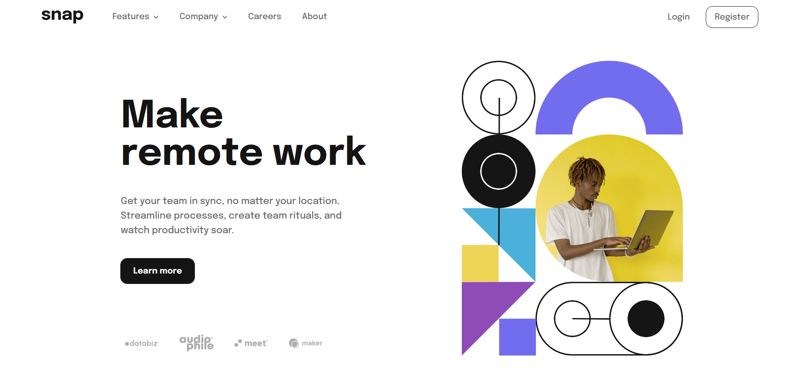
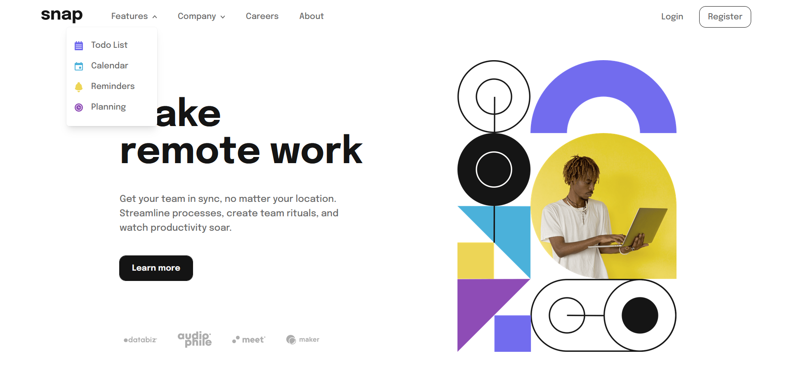
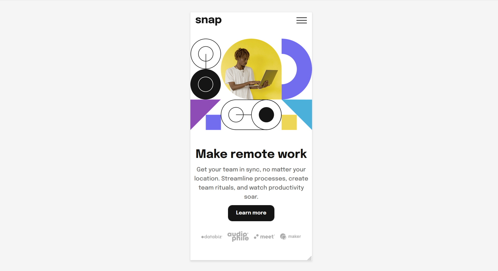
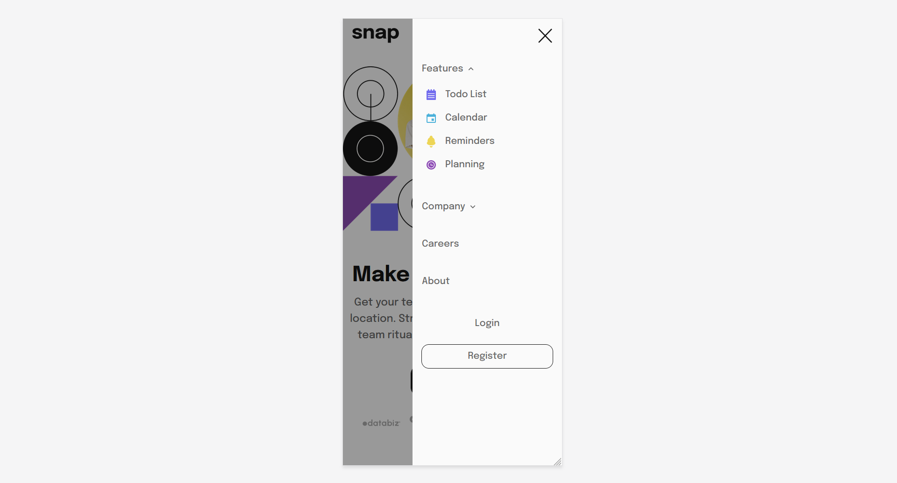

# Frontend Mentor - QR code component solution

This is a solution to the [NFT preview card component challenge on Frontend Mentor](https://www.frontendmentor.io/challenges/nft-preview-card-component-SbdUL_w0U).

## Table of contents

- [Overview](#overview)
  - [Screenshot](#screenshot)
  - [Links](#links)
- [My process](#my-process)
  - [Built with](#built-with)
- [Author](#author)

## Overview

### Screenshot
**Desktop Preview**

**Desktop hover Preview**

**Mobile Preview**

**Mobile Nav Preview**

### Links

- Solution URL: [Github Repo URL](https://github.com/Harry-Crocksick/intro_section)
- Live Site URL: [Deployed site URL](https://marn-intro-section.netlify.app/)

## My process
I used React and TailwindCSS to create this challenge. I used **Popover** from [@headlessui/react](https://headlessui.com/) for desktop and mobile size navigation bar's dropdown.
and used `useState` react hook to implement open/close function for Hamburger menu.

### Built with

- Semantic HTML5 markup
- [React](https://react.dev/)
- [TailwindCSS](https://tailwindcss.com/)
- [Headlessui](https://headlessui.com/)
- Mobile-first workflow

## Author

- Social Media - [Marn Tet Zan](https://www.facebook.com/james.christian.3914207)
- Frontend Mentor - [@Harry-Crocksick](https://www.frontendmentor.io/profile/Harry-Crocksick)

